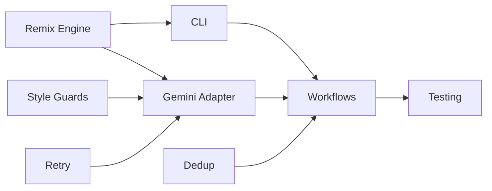

# 🚀 Nano Banana Runner - Quick Reference

## Current Status
**Phase 1**: ✅ Complete (GUI + Analysis)  
**Phase 2**: 🔄 In Progress (Remixing + AI)  
**Phase 3**: ⏳ Planned (Production)

## Todo List (18 Tasks)

### 🔴 P0 - Critical (Must Have)
1. [ ] Prompt remix engine with seeded RNG → `core/remix.ts`
2. [ ] CLI structure with commander → `cli.ts`
3. [ ] Vertex AI SDK setup → `adapters/geminiImage.ts`
4. [ ] Style-only conditioning guards → `core/styleGuard.ts`
5. [ ] Exponential backoff retry logic → `lib/retry.ts`

### 🟡 P1 - Important (Should Have)
6. [ ] Prompt template system → `core/templates.ts`
7. [ ] Style mixing algorithm → `core/remix.ts`
8. [ ] CLI commands (analyze, remix, render) → `commands/*.ts`
9. [ ] imagen-3 API integration → `adapters/geminiImage.ts`
10. [ ] Batch workflows (runRemix, runRender) → `workflows/*.ts`
11. [ ] SimHash deduplication → `core/dedupe.ts`
12. [ ] Cost controls & budgets → `core/pricing.ts`
13. [ ] Test suite (80% coverage) → `tests/**/*.test.ts`

### 🟢 P2 - Nice to Have
14. [ ] GUI prompt editor → `apps/gui/src/pages/PromptEditor.tsx`
15. [ ] CSV export/import → `adapters/csv.ts`
16. [ ] E2E pipeline tests → `tests/e2e/*.spec.ts`
17. [ ] Deployment docs → `docs/deployment.md`
18. [ ] GUI cost estimates → `apps/gui/src/components/CostEstimate.tsx`

## Key Commands

```bash
# Development
pnpm dev              # Start dev server
pnpm test:watch       # Run tests in watch mode
pnpm typecheck        # Check TypeScript

# CLI (after implementation)
nn analyze --in ./images --out ./descriptors.json
nn remix --descriptors ./descriptors.json --out ./prompts.json
nn render --prompts ./prompts.json --dry-run
nn gui                # Launch web interface

# Git
git checkout -b phase-2/[feature]
git commit -m "feat: [description]"
```

## Critical Paths



## Key Files to Create

```
src/
├── core/
│   ├── remix.ts          # P0: Prompt generation
│   ├── styleGuard.ts     # P0: Style protection
│   ├── dedupe.ts         # P1: Deduplication
│   └── pricing.ts        # P1: Cost control
├── adapters/
│   ├── geminiImage.ts    # P0: Vertex AI
│   └── csv.ts            # P2: Import/export
├── workflows/
│   ├── runRemix.ts       # P1: Batch remix
│   └── runRender.ts      # P1: Batch render
├── lib/
│   ├── retry.ts          # P0: Resilience
│   └── circuitBreaker.ts # P1: Stability
└── cli.ts                # P0: Entry point
```

## Environment Setup

```bash
# Required
export GOOGLE_CLOUD_PROJECT=your-project
export GOOGLE_CLOUD_LOCATION=us-central1

# Optional
export NN_PROVIDER=gemini
export NN_CONCURRENCY=2
export NN_MAX_PER_IMAGE=50
```

## Success Metrics

- **Phase 2**: 50 prompts/image, Gemini integration working
- **Phase 3**: Zero style copying, 99.9% uptime, 80% test coverage

## Cost Limits

- **Per Image**: $0.0025
- **Test Budget**: $10 max
- **Dry Run**: Always free

## Next Action

```bash
# Start with the remix engine
pnpm test:watch core/remix.test.ts
# Then implement core/remix.ts
```

---
Updated: 2025-09-08 | Ready for Phase 2