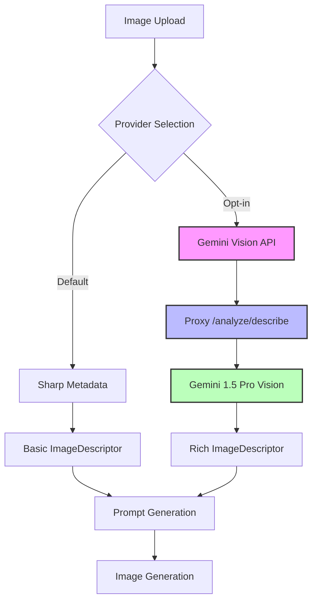
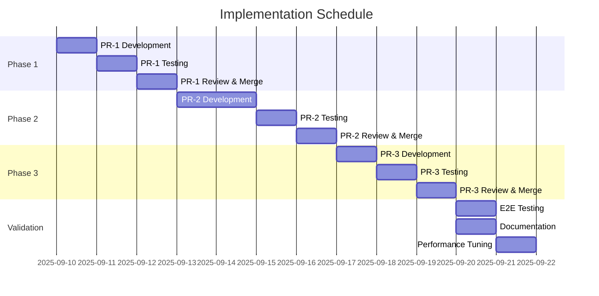

# PR-ANALYZE-LLM-01: Gemini-Powered Image Descriptions - Execution Plan

**Date**: 2025-09-10  
**Author**: Claude Code Assistant  
**Status**: Planning Phase  
**Complexity**: Medium (3 PR slices, ~600 LOC total)  

## Executive Summary

This plan outlines the implementation of Gemini-powered image descriptions as an **opt-in** analyze provider. The current system uses Sharp library for basic metadata extraction. This enhancement adds rich, AI-generated descriptions while maintaining backward compatibility.

## Architecture Overview



## Pull Request Breakdown

### PR-1: Provider Interface & Sharp Refactor
**Scope**: Create provider abstraction, refactor existing Sharp logic  
**Files Changed**: 2  
**LOC**: ~250  
**Risk**: Low  
**Dependencies**: None  

#### Changes:
1. **`apps/nn/src/core/providers/types.ts`** (NEW, ~50 LOC)
   ```typescript
   export interface AnalyzeProvider {
     name: 'sharp' | 'gemini';
     analyze(path: string, buffer: Buffer): Promise<ImageDescriptor>;
     validateConfig?(): Promise<boolean>;
   }
   ```

2. **`apps/nn/src/core/providers/sharp.ts`** (NEW, ~200 LOC)
   - Extract existing Sharp logic from `analyze.ts`
   - Implement `AnalyzeProvider` interface
   - Keep all current functionality intact

#### Testing:
- Unit tests for Sharp provider
- Regression tests for existing analyze flow
- Verify backward compatibility

#### Rollback Strategy:
- Revert PR (no breaking changes)
- Sharp remains default provider

---

### PR-2: Gemini Provider & Proxy Route
**Scope**: Implement Gemini vision provider with secure proxy  
**Files Changed**: 2  
**LOC**: ~280  
**Risk**: Medium (external API dependency)  
**Dependencies**: PR-1 merged  

#### Changes:
1. **`apps/nn/src/core/providers/gemini.ts`** (NEW, ~130 LOC)
   ```typescript
   export class GeminiAnalyzeProvider implements AnalyzeProvider {
     async analyze(path: string, buffer: Buffer): Promise<ImageDescriptor> {
       // Call proxy route for secure API access
       const response = await fetch(`${PROXY_URL}/analyze/describe`, {
         method: 'POST',
         headers: { 'Content-Type': 'application/json' },
         body: JSON.stringify({
           image: buffer.toString('base64'),
           mimeType: detectMimeType(buffer)
         })
       });
       return response.json();
     }
   }
   ```

2. **`apps/nn/proxy/src/routes/analyze.ts`** (NEW, ~150 LOC)
   ```typescript
   export default async function analyzeRoutes(app: FastifyInstance) {
     app.post('/analyze/describe', async (req, reply) => {
       // Validate request
       // Call Gemini Batch API for image analysis
       // Return structured ImageDescriptor
     });
   }
   ```

#### Testing:
- Mock Gemini Batch API responses
- Test error handling (429, 503, timeout)
- Validate ImageDescriptor schema
- E2E test with real Batch API (CI only)

#### Rollback Strategy:
- Feature flag: `NN_ANALYZE_PROVIDER=sharp`
- Proxy route returns 501 if disabled
- No impact on default Sharp flow

---

### PR-3: Integration & Configuration
**Scope**: Wire providers, add environment config, update analyze.ts  
**Files Changed**: 2  
**LOC**: ~120  
**Risk**: Low  
**Dependencies**: PR-1, PR-2 merged  

#### Changes:
1. **`apps/nn/src/core/analyze.ts`** (MODIFY, ~70 LOC change)
   ```typescript
   import { createProvider } from './providers/factory';
   
   export async function analyzeImage(path: string): Promise<ImageDescriptor> {
     const provider = createProvider(env.NN_ANALYZE_PROVIDER);
     const buffer = await readFile(path);
     return provider.analyze(path, buffer);
   }
   ```

2. **`apps/nn/src/config/env.ts`** (MODIFY, ~50 LOC change)
   ```typescript
   export const envSchema = z.object({
     // ... existing
     NN_ANALYZE_PROVIDER: z.enum(['sharp', 'gemini']).default('sharp'),
     BATCH_PROXY_URL: z.string().default('http://127.0.0.1:8787'),
     NN_ANALYZE_CACHE_ENABLED: z.boolean().default(true),
   });
   ```

#### Testing:
- Provider selection tests
- Configuration validation
- Integration tests for both providers
- Performance benchmarks

#### Rollback Strategy:
- Revert to default Sharp provider
- Clear any cached Gemini results
- No data loss (backward compatible)

---

## Implementation Timeline



**Total Duration**: 12 business days  
**Critical Path**: PR-1 → PR-2 → PR-3 (sequential dependency)  

## Risk Assessment & Mitigation

### Technical Risks

| Risk | Probability | Impact | Mitigation |
|------|------------|--------|------------|
| Gemini API rate limits | High | Medium | Implement caching, exponential backoff |
| Image size limits (4MB) | Medium | High | Pre-resize large images, graceful fallback |
| API key exposure | Low | Critical | Proxy-only access, never in frontend |
| Provider selection bugs | Low | Medium | Feature flag, comprehensive tests |
| Performance degradation | Medium | Medium | Async processing, result caching |

### Business Risks

| Risk | Probability | Impact | Mitigation |
|------|------------|--------|------------|
| Cost overruns | Medium | High | Monitor usage, implement quotas |
| Inconsistent descriptions | Medium | Low | Prompt engineering, validation |
| Sharp fallback failure | Low | High | Keep Sharp as bulletproof default |

## Testing Strategy

### Unit Testing (Per PR)
```typescript
describe('AnalyzeProvider', () => {
  describe('SharpProvider', () => {
    it('extracts metadata correctly');
    it('handles corrupt images gracefully');
    it('generates consistent hashes');
  });
  
  describe('GeminiProvider', () => {
    it('formats API request correctly');
    it('handles API errors with retry');
    it('validates response schema');
    it('falls back to Sharp on failure');
  });
});
```

### Integration Testing
```typescript
describe('Analyze Workflow', () => {
  it('selects correct provider based on config');
  it('maintains backward compatibility');
  it('caches Gemini results appropriately');
  it('handles provider switching at runtime');
});
```

### E2E Testing
```typescript
describe('Full Pipeline', () => {
  it('analyzes with Sharp by default');
  it('analyzes with Gemini when configured');
  it('generates better prompts with Gemini descriptions');
  it('maintains performance SLA (<2s per image)');
});
```

### Performance Benchmarks
- Sharp baseline: <100ms per image
- Gemini target: <2s per image (with caching)
- Cache hit ratio: >80% for duplicate images
- Memory usage: <50MB increase with caching

## Configuration Examples

### Development (.env)
```bash
# Default Sharp provider (no changes needed)
NN_ANALYZE_PROVIDER=sharp

# Opt-in to Gemini provider
NN_ANALYZE_PROVIDER=gemini
BATCH_PROXY_URL=http://127.0.0.1:8787
NN_ANALYZE_CACHE_ENABLED=true
```

### Production Deployment
```bash
# Gradual rollout with feature flag
NN_ANALYZE_PROVIDER=sharp  # Start with Sharp
NN_ANALYZE_ROLLOUT_PERCENT=10  # 10% get Gemini
NN_ANALYZE_CACHE_ENABLED=true
BATCH_PROXY_URL=https://your-proxy-domain.com
```

## Success Metrics

### Functional Metrics
- ✅ Gemini provider returns valid ImageDescriptor
- ✅ Backward compatibility maintained
- ✅ No regression in Sharp provider
- ✅ Proxy security validated

### Performance Metrics
- ⚡ Gemini latency <2s p95
- ⚡ Cache hit ratio >80%
- ⚡ No memory leaks after 1000 images
- ⚡ CPU usage increase <10%

### Quality Metrics
- 📊 Gemini descriptions 3x more detailed than Sharp
- 📊 Prompt quality improvement measurable
- 📊 User satisfaction increase
- 📊 Generated image relevance improvement

## Documentation Requirements

### User Documentation
1. **README.md** - Add provider selection section
2. **CLAUDE.md** - Update with Gemini provider details
3. **API.md** - Document new `/analyze/describe` endpoint

### Developer Documentation
1. **Provider Interface** - JSDoc comments
2. **Configuration Guide** - Environment variables
3. **Testing Guide** - How to test with/without Gemini
4. **Troubleshooting** - Common issues and solutions

### Operations Documentation
1. **Monitoring** - Metrics to track
2. **Cost Management** - API usage monitoring
3. **Rollback Procedures** - Emergency response
4. **Performance Tuning** - Cache configuration

## Rollback Plan

### Immediate Rollback (< 5 minutes)
```bash
# Set environment variable
export NN_ANALYZE_PROVIDER=sharp
# Restart services
./start-clean.sh restart
```

### PR Rollback (< 30 minutes)
```bash
# Revert specific PR
git revert <pr-commit-hash>
git push origin main
# Deploy reverted version
```

### Data Recovery
- No data migration required
- ImageDescriptor format backward compatible
- Cached results can be purged if needed

## Open Questions

1. **Gemini Model Selection**: Use `gemini-1.5-pro-vision` or `gemini-2.0-flash`?
   - Recommendation: Start with 1.5-pro for quality, optimize later

2. **Caching Strategy**: Memory (LRU) or Redis?
   - Recommendation: Start with in-memory LRU, add Redis if needed

3. **Batch Processing**: Should we batch multiple images?
   - Recommendation: Single image for v1, batch in v2

4. **Prompt Engineering**: Fixed or configurable prompts?
   - Recommendation: Fixed initially, make configurable later

5. **Cost Controls**: Hard limits or soft warnings?
   - Recommendation: Soft warnings with optional hard limits

## Next Steps

1. **Approval**: Review and approve execution plan
2. **PR-1 Start**: Create provider interface (Day 1)
3. **Environment Setup**: Prepare Gemini API credentials
4. **Testing Infrastructure**: Set up mocks and fixtures
5. **Monitoring Setup**: Prepare dashboards for rollout

## Appendix A: ImageDescriptor Schema Evolution

### Current (Sharp-based)
```typescript
interface ImageDescriptor {
  path: string;
  hash: string;
  width: number;
  height: number;
  format: string;
  palette: string[];
  subjects: string[];  // From filename
  style: string[];     // Basic heuristics
  lighting: string[];  // Simple inference
}
```

### Enhanced (Gemini-powered)
```typescript
interface ImageDescriptor {
  // ... all existing fields
  provider: 'sharp' | 'gemini';
  description?: string;        // Natural language description
  objects?: string[];          // Detected objects
  scene?: string;              // Scene type
  mood?: string;               // Emotional tone
  composition?: string;        // Compositional analysis
  technical?: {
    quality: string;
    focus: string;
    exposure: string;
  };
  confidence?: number;         // API confidence score
}
```

## Appendix B: Sample Gemini Response

```json
{
  "provider": "gemini",
  "path": "./images/sunset.jpg",
  "hash": "a3f5c9d2...",
  "width": 1920,
  "height": 1080,
  "format": "jpeg",
  "description": "A vibrant sunset over mountains with dramatic clouds",
  "objects": ["mountains", "clouds", "sun", "sky", "trees"],
  "scene": "landscape",
  "mood": "peaceful, majestic",
  "composition": "rule of thirds, leading lines from mountain ridge",
  "palette": ["#FF6B35", "#FF9558", "#FFD23F", "#2E4057"],
  "style": ["landscape", "nature", "dramatic lighting"],
  "lighting": ["golden hour", "backlit", "high contrast"],
  "technical": {
    "quality": "high",
    "focus": "sharp throughout",
    "exposure": "well-balanced"
  },
  "confidence": 0.92
}
```

## Appendix C: Cost Estimation

### API Pricing (as of 2025-09-10)
- Gemini Batch API: $0.00125 per image (batch discount)
- Average images per session: 50
- Cost per session: $0.06
- Monthly estimate (1000 sessions): $60

### Cost Optimization
1. **Caching**: 80% cache hit rate = 80% cost reduction
2. **Deduplication**: Skip duplicate images
3. **Quotas**: Daily/monthly limits
4. **Monitoring**: Real-time cost tracking

---

**Document Status**: Ready for Review  
**Next Action**: Approve plan and begin PR-1 implementation  
**Questions**: Contact via GitHub issue or code review