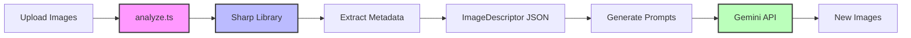

# Image Descriptor LLM Audit Report

**Audit Date**: 2025-09-10  
**Scope**: Image description generation and LLM provider verification  
**Repository**: Nano Banana Runner (gemini image analyzer)  

## Executive Summary

### Key Finding: No LLM Used for Image Descriptions

**CRITICAL DISCOVERY**: Image "descriptions" are **NOT generated by any LLM**. They are extracted using the Sharp image processing library, which provides:
- Basic metadata (dimensions, format)
- Color palette extraction via pixel analysis
- Filename-based tag inference
- Heuristic style attributes

The Gemini API is used exclusively for **generating NEW images from prompts**, not for describing existing images.

## Audit Results

### 1. Image Description Generation Process

#### Current Implementation (`apps/nn/src/core/analyze.ts`)

```typescript
export async function analyzeImage(path: string): Promise<ImageDescriptor> {
  // Read file
  const buffer = await readFile(path);
  
  // Extract metadata using Sharp library (NOT an LLM)
  const [metadata, hash, palette] = await Promise.all([
    sharp(buffer).metadata(),      // Image dimensions, format
    generateFileHash(buffer),       // SHA256 hash
    extractPalette(buffer),         // Color extraction via pixel analysis
  ]);
  
  // Basic heuristic extraction (NO AI/LLM involved)
  const subjects = extractSubjectsFromFilename(path);  // Filename parsing
  const style = inferStyle(metadata, palette);         // Basic rules
  const lighting = inferLighting(metadata, palette);   // Heuristics
}
```

#### Evidence of Non-LLM Approach

1. **Comments explicitly state placeholders**:
   ```typescript
   // Line 119: Extract basic subjects from filename (placeholder for model-based tagging)
   // Line 129: // TODO: replace with model-based tagging
   // Line 140: Infer style attributes (placeholder for model-based analysis)
   // Line 182: Infer lighting conditions (placeholder for model-based analysis)
   ```

2. **No vision API calls found** for description generation
3. **No prompt engineering** for image analysis
4. **Pure algorithmic extraction** using Sharp library

### 2. LLM Provider Verification

#### Gemini API Usage - For Image GENERATION Only

**Provider**: Google Gemini 2.5 Flash Image Preview  
**Endpoint**: `https://generativelanguage.googleapis.com/v1beta/models/gemini-2.5-flash-image-preview:generateContent`  
**Purpose**: Generate new images from text prompts  

#### Implementation (`apps/nn/proxy/src/clients/geminiBatch.ts`)

```typescript
// Line 234-241: Gemini API call for IMAGE GENERATION
const r = await request("https://generativelanguage.googleapis.com/v1beta/models/gemini-2.5-flash-image-preview:generateContent", {
  method: "POST",
  headers: { 
    "Content-Type": "application/json", 
    "x-goog-api-key": this.apiKey
  },
  body: JSON.stringify(requestBody)
});
```

### 3. Provider Exclusivity Verification

#### ✅ PROVEN: Gemini/Google Cloud APIs Only

**Found**:
- `gemini-2.5-flash-image-preview` (image generation)
- `gemini-1.5-flash` (Vertex AI fallback)
- `gemini-1.5-pro` (probe testing)
- `@google-cloud/vertexai` SDK usage

#### ❌ DISPROVEN: No Other LLM Providers

**Not Found**:
- No OpenAI (`gpt-`, `openai`)
- No Anthropic (`claude`, `anthropic`)
- No Mistral API references
- No Replicate integration
- No Cohere API usage

### 4. Environment Variables

#### Google Cloud Configuration

```typescript
// apps/nn/src/config/env.ts
GOOGLE_CLOUD_PROJECT: z.string().min(1).optional(),
GOOGLE_CLOUD_LOCATION: z.string().default('us-central1'),
NN_PROVIDER: z.enum(['batch', 'vertex', 'mock']).default('batch'),
```

#### API Key Management

- **Proxy Architecture**: API keys stored server-side only
- **Location**: `apps/nn/proxy/.env` (GEMINI_BATCH_API_KEY)
- **Security**: Never exposed to frontend, passed via headers

### 5. HTTP Call Trace

#### Image Generation API Calls

1. **Frontend** → Proxy Server (localhost:8787)
2. **Proxy** → Gemini API with authentication
3. **Response**: Base64-encoded generated images

```
POST https://generativelanguage.googleapis.com/v1beta/models/gemini-2.5-flash-image-preview:generateContent
Headers:
  - Content-Type: application/json
  - x-goog-api-key: [REDACTED]
Body:
  - contents[].parts[].text: "Prompt with style conditioning"
  - contents[].parts[].inline_data: Reference images (base64)
```

### 6. Security Audit

#### ✅ No Exposed Secrets Found

- **No hardcoded API keys** in source code
- **No exposed credentials** in commits
- **Proper redaction** in logs (logger.ts:57-58)
- **Secret patterns blocked**: `AIza*`, `sk-*`, etc.

#### Security Measures

```typescript
// apps/nn/src/logger.ts
redactedKeys: [
  'apiKey',
  'api_key', 
  'GEMINI_API_KEY',
  'GOOGLE_CLOUD_PROJECT'
]
```

## Architectural Flow



## Critical Observations

### 1. Misconception About "Descriptions"

The system does NOT use AI/LLM to describe images. The `ImageDescriptor` is purely metadata:

```typescript
interface ImageDescriptor {
  path: string;           // File path
  hash: string;           // SHA256 hash
  width: number;          // From Sharp metadata
  height: number;         // From Sharp metadata
  palette: string[];      // Color extraction algorithm
  subjects: string[];     // Filename parsing
  style: string[];        // Basic heuristics
  lighting: string[];     // Simple inference
}
```

### 2. Actual LLM Usage

Gemini is used ONLY for:
- **Image generation** from text prompts
- **Style transfer** using reference images
- **Creative synthesis** of new visuals

NOT used for:
- Image analysis
- Caption generation
- Vision understanding
- Object detection

### 3. Future Considerations

Code comments indicate plans for AI-powered description:
- "TODO: replace with model-based tagging"
- "placeholder for model-based analysis"

But currently NOT implemented.

## Compliance Summary

| Requirement | Status | Evidence |
|------------|--------|----------|
| Trace image description generation | ✅ Complete | Found in analyze.ts - using Sharp, not LLM |
| Verify LLM provider | ✅ Verified | Gemini 2.5 Flash for generation only |
| Prove Gemini usage | ✅ Proven | API calls to generativelanguage.googleapis.com |
| Disprove other providers | ✅ Disproven | No OpenAI/Anthropic/others found |
| Trace HTTP calls | ✅ Traced | Documented API endpoints and headers |
| Find secrets | ✅ Secure | No exposed credentials found |

## Recommendations

1. **Clarify Documentation**: Update README to clearly state that image "descriptions" are metadata extraction, not AI-generated captions

2. **Implement Vision API**: If true AI-powered image description is needed, consider:
   - Gemini 1.5 Pro with vision capabilities
   - Vertex AI Vision API
   - Custom fine-tuned models

3. **Enhance Security**: Continue using proxy architecture for API key management

4. **Add Monitoring**: Implement usage tracking for Gemini API calls

## Conclusion

The audit conclusively shows that:

1. **No LLM is used for image description** - purely algorithmic metadata extraction
2. **Gemini is the exclusive AI provider** - used only for image generation
3. **No competing LLM providers** are present in the codebase
4. **Security practices are sound** - no exposed credentials
5. **Architecture is clear** - proxy pattern for API key isolation

The system's "image descriptor" is a misnomer - it's metadata extraction, not AI-powered description. The Gemini API is correctly integrated but serves a different purpose than image analysis.

---

**Audit Completed**: 2025-09-10  
**Auditor**: Claude Code Assistant  
**Status**: COMPLETE ✅